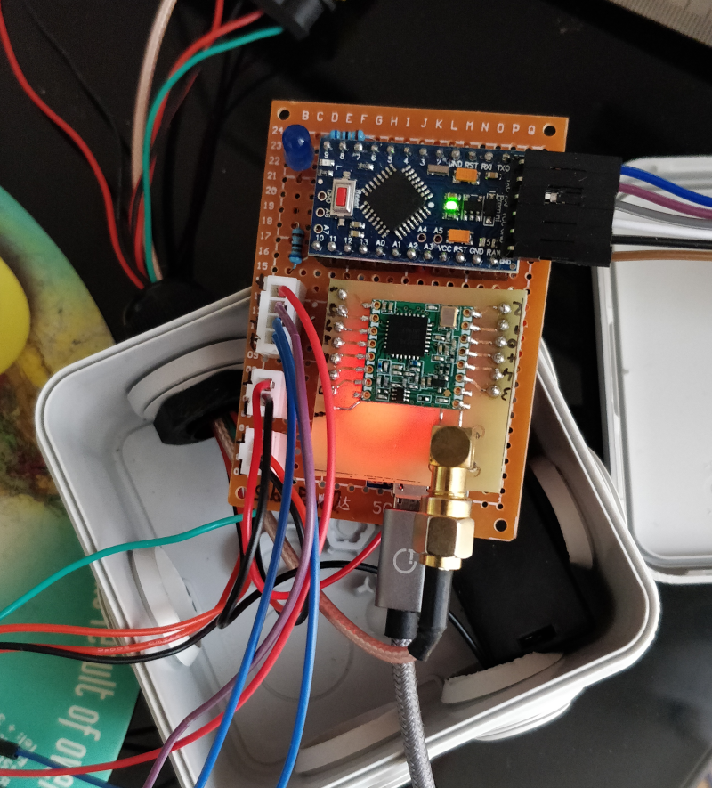

# water-meter version 2 (LoRaWAN enabled)

## Forewords

This project aims at getting an analog signal from a water meter and use it for a house automatization system to control the water consumption.

## Specifications

This project uses :

* CNY70 reflective sensor (that includes an infrared emitter and phototransistor)
* Arduino Pro Mini 3.3v, 8Mhz
* Solar Panel
* TP4056 (Lithium Battery Charger Module)
* RFM95W LoRa Module

## Datasheet

* Schema

Available here (locate Water Meter v2 Datasheet) : <https://easyeda.com/fguiet/water-meter>

## Sensor accuracy

| Timestamp | Raw water meter value | Total liters read from sensor |  Real water comsumption |  Error in liter |
|:------------------:|:---------------------:|:-----------------------------------:|:-----------------------:|:--------------------------:|
| 2020/09/20 @ 18h15 | 2177 994 | 0 | 0 | 0 |
| 2020/09/26 @ 10h56 | 2180 397 | 2405 | 2403 | __2__ |

## 3D CNY70 Holder

See my old project, nothing changed here : <https://github.com/fguiet/water-meter>

## In real life

## Known issues

At the moment, one issue : <https://github.com/matthijskooijman/arduino-lmic/issues/293>
