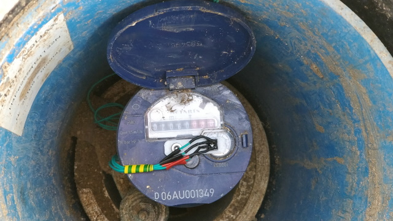
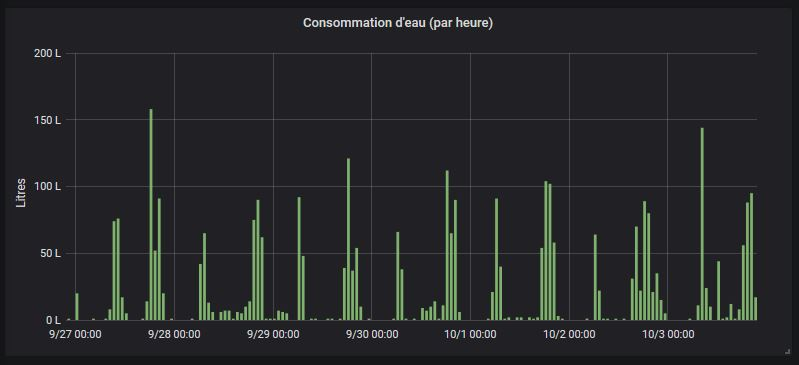
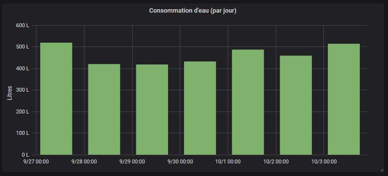

# water-meter version 2 (LoRaWAN enabled)

## Forewords

This project aims at getting an analog signal from a water meter and use it for a house automatization system to control the water consumption.

The principle is very basic. My water meter has got a silverish arrow which turns 360° each time one liter is consumed.

I just installed a CNY70 reflective sensor so each time the silver arrow pass underneath then a LoRa message is sent to my automation server.

## Specifications

This project uses :

* CNY70 reflective sensor (that includes an infrared emitter and phototransistor)
* Arduino Pro Mini 3.3v, 8Mhz
* Solar Panel
* Update 2020/12/11 : Change TP4056 lithium battery charger model from [this one](https://fr.aliexpress.com/item/32705078422.html) to [this one](https://components101.com/tp4056a-li-ion-battery-chargingdischarging-module). This new model includes a over-discharge protection.
* RFM95W LoRa Module

## Datasheet

* Schema

Available here (locate Water Meter v2 Datasheet) : <https://easyeda.com/fguiet/water-meter>

__Caution__ : The potentiometer should be adjusted using debug mode. `INTERRUPT_PIN` should report 1 only when the silver arrow is underneath the CNY70 sensor.

## Sensor accuracy

| Timestamp | Raw water meter value | Total liters read from sensor |  Real water comsumption |  Error in liter |
|:------------------:|:---------------------:|:-----------------------------------:|:-----------------------:|:--------------------------:|
| 2020/09/20 @ 18h15 | 2177 994 | 0 | 0 | 0 |
| 2020/09/26 @ 10h56 | 2180 397 | 2405 | 2403 | __2__ |

## 3D CNY70 Holder

See my old project, nothing changed here : <https://github.com/fguiet/water-meter>

## In real life

* CNY70 Sensor + custom 3D printed holder on water meter

* The electronic parts in the waterproof box

## Some charts

Proof of concept : some charts

* Water consumption per hour

* Water consumption per day

As you can see, on average, we consume around 400 liter per day (we are 4 in the house).

## Known issues

At the moment, one issue : <https://github.com/matthijskooijman/arduino-lmic/issues/293>
